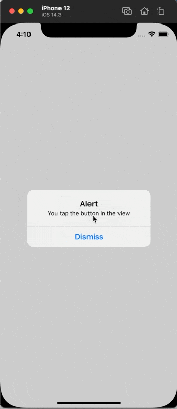

# Responder

A Responder Chain tools.


## Use

```swift
import Responder

class Cell: UITableViewCell {
    // ... some codes
    
    let button = UIButton()
    
    let model: CellModel?
    
    @objc func buttonAction(_ sender: Any) {
        guard let model = self.model else { return }
        self.dispatch(event: "cellButtonClick", params: ["model": model])
    }
}


import Responder
class Controller: UIViewController {
    // ... some codes
    
    @Respondable private var cellButtonClick = Controller.cellButtonClick
    
    func cellButtonClick(_ param: ResponderParam?) {
        guard let model = param?["model"], let cell = param.source as? Cell else { return }
        // do something ...
    }
}
```


```swift
class View: UIView {

    let button = UIButton()

    override init(frame: CGRect) {
        super.init(frame: frame)

        addSubview(button)

        button.setTitle("Tap to responder", for: .normal)
        button.setTitleColor(.black, for: .normal)

        button.addTarget(self, action: #selector(buttonClickAction(_:)), for: .touchUpInside)
    }

    required init?(coder: NSCoder) {
        fatalError("init(coder:) has not been implemented")
    }

    override func layoutSubviews() {
        super.layoutSubviews()

        button.frame = .init(x: (self.frame.width - 160) / 2, y: (self.frame.height - 44) / 2, width: 160, height: 44)
    }

    @objc func buttonClickAction(_ sender: Any) {
        self.dispatch(event: "viewButtonTapAction")
    }
}

class ViewController: UIViewController {

    let actionView = View()

    // MARK:- Respondable
    @Respondable private var viewButtonTapAction = ViewController.viewButtonTapAction

    override func viewDidLoad() {
        super.viewDidLoad()
        // Do any additional setup after loading the view.

        self.view.addSubview(actionView)
    }

    override func viewDidLayoutSubviews() {
        super.viewDidLayoutSubviews()

        actionView.frame = UIScreen.main.bounds
    }

    func viewButtonTapAction(_ param: ResponderParam?) {
        let alert = UIAlertController(title: "Alert", message: "You tap the button in the view", preferredStyle: .alert)
        alert.addAction(.init(title: "Dismiss", style: .cancel, handler: nil))
        self.present(alert, animated: true, completion: nil)
    }
}
```




## Custome

eg: IGListKit
```swift
import Responder
import IGListKit

extension ListSectionController: Responder {
    public var nextResponder: Responder? {
        get {
            objc_getAssociatedObject(self, &ResponderKeys.nextResponder) as? Responder
        }
        set {
            objc_setAssociatedObject(self, &ResponderKeys.nextResponder, newValue,  .OBJC_ASSOCIATION_ASSIGN)
        }
    }
}
```


## Install

#### Swift Package Manager
```swift
.package(url: "https://github.com/iWECon/Responder", from: "1.0.0")
```
